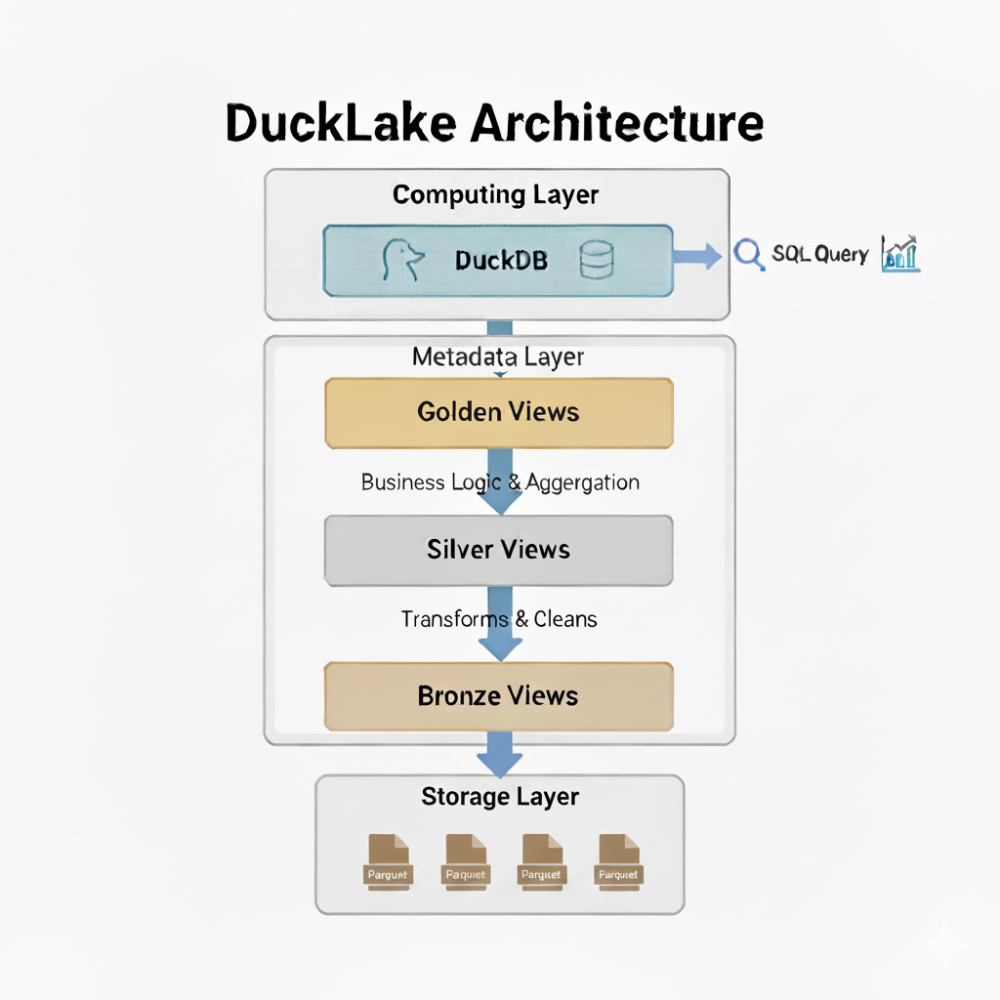
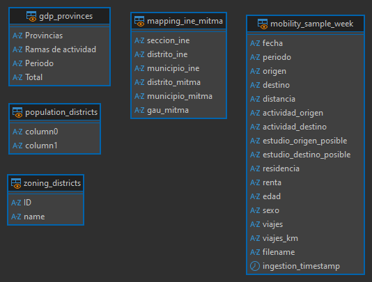
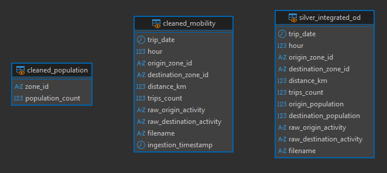

# Engineering Log: Sprint 1 - Schema Design and Prototyping

**Authors:**
- María López Hernández
- Fernando Blanco Membrives
- Joan Sánchez Verdú

**Date:** 14/11/2025

**Status:** In Progress

## 1. Sprint Overview & Objectives

The primary objective of Sprint 1 is to design the foundational schemas for the 3-tier data lakehouse and build a working Proof of Concept (PoC) for the data ingestion and transformation pipeline. This log documents the process, decisions, and outcomes for the entire sprint.

**Key Goals for Sprint 1:**
1.  Source and explore a one-week sample of data from MITMA and INE.
2.  Define the schemas for the Bronze, Silver, and Gold layers.
3.  Implement the ingestion process for the Bronze layer.
4.  Implement the transformation logic for the Silver layer.
5.  Implement the aggregation logic for the Gold layer to support the key business questions.

**Architecture Overview:**
- 

---

## 2. Data Sourcing & Exploration

This phase involved identifying, downloading, and performing a preliminary inspection of all required datasets for the one-week prototype (May 8-14, 2023).

-   **MITMA Data:** Sourced from the official Open Data portal. This included 7 daily mobility files (`*_Viajes_distritos.csv.gz`) and several supporting metadata files (`nombres_distritos.csv`, `poblacion_distritos.csv`, `relacion_ine_zonificacionMitma.csv`).
-   **INE Data:** Sourced from the INEbase portal. This included (`municipios_coordenadas.csv` and `ine_renta_distritos.csv`)
    - Access to the INE files: 
        - https://www.ine.es/dynt3/inebase/index.htm?padre=12385&capsel=12384 
        - https://centrodedescargas.cnig.es/CentroDescargas/detalleArchivo?sec=9000004# 

All source files are stored locally in the `data/raw/` directory, **which is excluded from version control**.

---

## 3. Proof of Concept Implementation

This section details the step-by-step implementation of the 3-tier lakehouse PoC.

### 3.1. Bronze Layer Ingestion `(Completed)`

The Bronze layer creates a raw, immutable, and performant copy of the source data.

-   **Design Philosophy:**
    -   **Fidelity:** Data is ingested with a 1-to-1 correspondence to the source files. No data content is altered, filtered, or cleaned.
    -   **Robustness:** To prevent ingestion failures, all columns from source CSVs are explicitly ingested as `VARCHAR` using the `all_varchar=true` option in DuckDB. This decision was made after an initial attempt failed due to a type conversion error on the `estudio_destino_posible` column (could not convert `"si"` to `BOOLEAN`). This approach makes the pipeline resilient to source data quality issues.
    -   **Optimization:** Source CSV files are converted to the columnar Parquet format for significantly improved query performance.
    -   **Auditability:** Key metadata is added during ingestion, including a precise `ingestion_timestamp` (`TIMESTAMP WITH TIME ZONE`) and the source `filename`.

-   **Implementation Outcome:**
    The ingestion was performed using DuckDB's `COPY` command. The following Parquet files were successfully created in the `data/lakehouse/bronze/` directory:
    -   `mobility_sample_week.parquet`
    -   `zoning_districts.parquet`
    -   `population_districts.parquet`
    -   `mapping_ine_mitma.parquet`
    -   `ine_rent_districts.parquet`
    -   `municipal_coordinates.parquet`

-   **Status:** The Bronze layer is complete and validated for the Sprint 1 sample data.

- **Schema:**
    - 

---

# 3.2. Silver Layer Transformation `(Completed)`

The Silver layer serves as the "single source of truth" within the lakehouse. Its purpose is to transform the raw, disparate data from the Bronze layer into a cohesive set of cleaned, integrated, and well-structured views ready for analysis. This was achieved by creating a series of modular, interdependent views.

#### Silver Schema Overview

The final Silver layer consists of several specialized views that build upon each other, culminating in a rich, integrated dataset.

-   **Component Views:**
    -   `silver.cleaned_mobility`: Cleans and standardizes raw trip records.
    -   `silver.cleaned_population`: Cleans and types population data.
    -   `silver.cleaned_district_rent`: Cleans and types district-level rent data.
    -   `silver.mapping_ine_mitma_districts`: Provides the crucial link between MITMA and INE coding systems.
    -   `silver.zoning_districts`: Provides a clean, stable interface to district names.
    -   `silver.municipal_coordinates`: Provides a clean table with INE codes and their latitude and longitude coordinates.
-   **Integrated Views:**
    -   `silver.silver_zone_metrics`: A powerful analytical view that combines population and economic data for each origin-destination pair with their latitude and longitude.
    -   `silver.silver_integrated_od`: The primary fact table, enriching each trip record with origin and destination population.

#### Data Transformation Logic

**1. Mobility Data Cleaning (`silver.cleaned_mobility`)**
-   **Date & Time Conversion**: Transformed `fecha` (e.g., `"20230508"`) to a proper `DATE` type and cast `periodo` to `hour` as an `INTEGER`.
-   **Distance Calculation**: Implemented a precise distance calculation using `avg_distance_per_trip_km = viajes_km / viajes`. This replaced the initial estimation from categorical ranges, providing a more accurate metric. A `CASE` statement was used to robustly handle cases where `viajes` is zero to prevent division-by-zero errors.
-   **Type Casting & Standardization**: Cast `viajes` to `BIGINT` for safety and renamed columns to a clear, English-based standard (e.g., `origen` → `origin_zone_id`).
-   **Column Pruning**: Removed `actividad_origen`, `actividad_destino`, `estudio_origen_posible`, `estudio_destino_posible`, `residencia`, `renta`, `edad`, `sexo` columns as they were deemed not necessary for the core analytical model, resulting in a leaner and more focused view.

**2. Demographic & Economic Data Cleaning**
-   **Population (`silver.cleaned_population`):** Handled `'NA'` string values by converting them to `NULL` using `TRY_CAST` to prevent data loss or query failure. Renamed generic `column0`/`column1` to `zone_id`/`population_count`.
-   **Rent (`silver.cleaned_district_rent`):** Filtered for the relevant indicator (`'Renta neta media por persona'`) and year (`2023`). Extracted the numeric `district_code` using `REGEXP_EXTRACT` and cleaned the monetary value by removing `.` separators and casting to `DOUBLE` for precision.
-   **Mapping (`silver.mapping_ine_mitma_districts`):** Created a clean, two-column view to serve as the "Rosetta Stone" for translating between MITMA and INE district codes, essential for joining rent data.
-  **Coordinates (`silver.cleaned_municipal_coordinates`):** Just kept the first 5 digits of INE_COD, the municipal name, the longitude and the latitude casted to `DOUBLE`.

**3. Data Integration**

The final step in the Silver layer is to integrate the cleaned component views into powerful, enriched datasets. Two distinct integrated views were created, each serving a different analytical purpose.

#### a. `silver.silver_integrated_od`: Enriching Individual Trips

This view serves as the primary **fact table** for the lakehouse. Its purpose is to enrich each individual trip record with essential demographic information.

-   **Granularity:** Each row represents a group of trips for a specific hour between a unique origin-destination pair.
-   **Enrichment Logic:** It takes the `silver.cleaned_mobility` view as its base and performs a `LEFT JOIN` to the `silver.cleaned_population` view **twice**:
    1.  The first join matches `origin_zone_id` to `zone_id` to attach the `origin_population`.
    2.  The second join matches `destination_zone_id` to `zone_id` to attach the `destination_population`.
-   **Outcome:** This creates a comprehensive table where every trip is linked to the population of both its start and end points, enabling fine-grained analysis of travel events.

#### b. `silver.zone_metrics`: Creating a Zone-to-Zone Profile

This view serves as a powerful **dimensional summary table** describing the structural relationship between every pair of zones that have recorded travel activity. It consolidates the essential geographic and socio-economic attributes needed for downstream modeling without performing any model-specific transformations.

-   **Granularity:** Each row represents a unique origin-destination pair.
-   **Integration Logic:**
    -   It first identifies all unique OD pairs from the mobility data.
    -   It crucially uses `silver.mapping_ine_mitma_districts` to translate the MITMA district codes for each origin and destination into their corresponding INE codes.
    -   It then performs a series of `LEFT JOIN` operations to enrich each OD pair with:
        -   **Population** for the origin and destination (by joining on the MITMA codes).
        -   **Average Net Rent** for the origin and destination (by joining on the translated INE codes).
        -   **Average Distance** between the pair.
        -   **Coordinates** of each one of the pair elements.
-   **Outcome:** This creates a comprehensive metrics table describing the socio-economic and geographic relationship between zones, serving as a direct and optimized input for the gravity model and other macro-level analyses.

#### Key Architectural Decisions
-   **View-Based Architecture**: The entire Silver layer was implemented as a series of logical views. This prevents data duplication, keeps the `lakehouse.duckdb` catalog lightweight, and ensures that any updates to Bronze-level logic are instantly propagated downstream.
-   **Modular Design**: By creating separate cleaning views for each entity (mobility, population, rent), the logic is kept modular and easy to maintain. The final `silver.zone_metrics` view then composes these components into a final, integrated product.
-   **Defensive Data Typing**: Used `TRY_CAST` for all numeric conversions from text and `VARCHAR` for identifiers that could contain non-numeric characters (`_AM`). This makes the entire pipeline resilient to data quality issues in the source files.

### Schema Design
- **Consistent Naming**: Used English snake_case convention across all tables
- **Audit Trail**: Preserved original filenames and ingestion timestamps for traceability of the mobility
- **Data Typing**: Ensured proper data types for efficient storage and query performance
- **Schema:**
    - 

---

### 3.3. Gold Layer Aggregation `(To Be Implemented)`

The Gold layer consists of business-ready, aggregated data products specifically designed to answer the project's key business questions.

-   **Planned Steps:**
    1.  **Read Data:** Source all data from the Silver layer tables.
    2.  **Business Question 1 (Typical Day):** Create the `gold_hourly_mobility_patterns` table by aggregating trip data by hour and day type (e.g., weekday/weekend).
    3.  **Business Question 2 (Infrastructure Gaps):** Create the `gold_gravity_model_inputs` table by joining trip data with population and economic indicators, preparing the necessary inputs for the gravity model formula.

-   **Implementation Details:**
    `[TODO: Document the final Gold layer aggregation queries and the resulting table schemas once this step is completed.]`

---

*This document will be updated as progress is made on the Silver and Gold layers.*