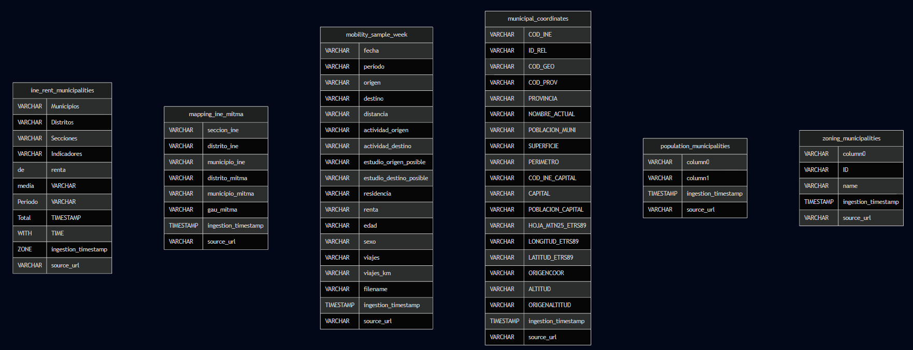
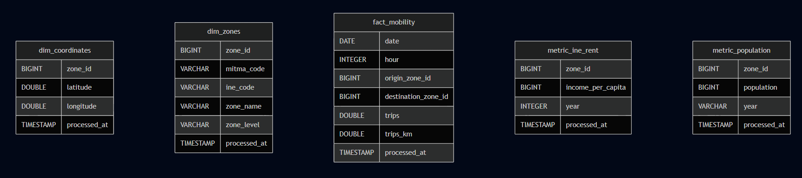

# Engineering Log: Sprint 2 - Schema reDesign and Prototyping

**Authors:**
- María López Hernández
- Fernando Blanco Membrives
- Joan Sánchez Verdú

**Date:** 24/11/2025

**Status:** In Progress

## 1. Sprint Overview & Objectives

...

**Key Goals for Sprint 2:**
1.  ...

---

## 2. Data Sourcing & Exploration

...

## 3. Proof of Concept Implementation

This section details the step-by-step implementation of the 3-tier lakehouse PoC.

### 3.1. Bronze Layer Ingestion `(In progress)`

The Bronze layer serves as the raw data reservoir for the Lakehouse, adhering to the principle of **Schema-on-Read**. The primary objective at this stage is to ingest data from public sources (MITMA, INE, CNIG) with minimal transformation, ensuring fidelity to the original source while preparing the storage structure for scalability.

**1. Design Principles & Metadata**
To ensure auditability and robustness, we implemented a standardized ingestion pattern for all tables:
*   **Data Fidelity:** All columns are ingested as `VARCHAR` (using DuckDB's `all_varchar=true`). This prevents ingestion failures due to data type mismatches (e.g., Spanish decimal formatting with commas/dots) and postpones type casting to the Silver layer.
*   **Audit Columns:** Two metadata columns were appended to every table during ingestion:
    *   `ingestion_timestamp`: records exactly when the data entered the lakehouse.
    *   `source_url`: provides lineage traceability back to the specific public domain origin.

**2. Mobility Data Strategy**
The core mobility dataset (`mobility_sample_week`) presents a Big Data challenge, with potential volumes reaching billions of records. To handle this:
*   **Partitioning Strategy:** We implemented physical partitioning by **Date** (`fecha`).
*   **Implementation:** A "Define-Configure-Insert" pattern was used. We first defined the schema, explicitly configured the partition key via `SET PARTITIONED BY (fecha)`, and then inserted the data. This forces DuckLake to write data into physically separated folders (e.g., `/fecha=20230508/...`), optimizing downstream read performance by allowing query engines to skip irrelevant days.

**3. Auxiliary Data (Dimensions) Handling**
Contextual datasets (Zoning, Population, Economics) were ingested as unpartitioned tables due to their small size. A flexible Python ingestion function was developed to handle the heterogeneous formats of Spanish public administration files:
*   **Separator Handling:** Dynamically switching between Semicolon (`;`) for INE data and Pipe (`|`) for MITMA data.
*   **Header Repair:** MITMA dictionary files (e.g., `zoning_municipalities`) often lack standard headers or contain malformed first rows (e.g., `|ID|name`). We utilized `header=True` logic to correctly interpret these raw structures without manual intervention.

**4. Bronze Artifacts**
The following tables have been successfully established in the `lakehouse.bronze` schema:

| Table Name | Type | Source | Description |
| :--- | :--- | :--- | :--- |
| **`mobility_sample_week`** | Fact | MITMA | Raw O-D trip matrices. Partitioned by `fecha`. |
| **`zoning_municipalities`** | Dim | MITMA | Mapping of MITMA IDs to Municipality Names. |
| **`population_municipalities`** | Metric | MITMA | Resident population counts (raw strings with thousands separators). |
| **`mapping_ine_mitma`** | Map | MITMA | Cross-reference table linking MITMA zoning codes to INE administrative codes. |
| **`ine_rent_municipalities`** | Metric | INE | Average net income per person by municipality. |
| **`municipal_coordinates`** | Dim | CNIG | Geospatial centroids (Lat/Lon) for distance calculations. |

**5. Schema:**
- 
---

### 3.2. Silver Layer Transformation `(In progress)`

### 3.2. Silver Layer Transformation `(In progress)`

The Silver layer represents the **"Trusted"** zone of the Lakehouse. In this stage, we transitioned from raw strings to strongly typed data, applied business rules for data integration, and established a **Star Schema** architecture to facilitate downstream analytics. The primary transformation engine used was DuckDB SQL.

**1. Data Cleaning & Type Casting Strategy**
A major challenge was handling the heterogeneity of Spanish numeric formats in the Bronze text files. We implemented a robust casting strategy to prevent data loss:
*   **Spanish Number Handling:** Raw inputs often used dots for thousands and commas for decimals (e.g., `"1.200,50"`). We applied a standardization functions chain: `TRY_CAST(REPLACE(REPLACE(col, '.', ''), ',', '.') AS DOUBLE)`.
*   **The "Zero" Trap:** For integer metrics (Population), we strictly cast to `DOUBLE` before `BIGINT` (e.g., `CAST(TRY_CAST('10.0' AS DOUBLE) AS BIGINT)`). This prevented truncating values like `"50.0"` into `"5"`, a common error when using string manipulation on floating-point strings.
*   **Safe Casting:** `TRY_CAST` was used universally to return `NULL` instead of crashing the pipeline when encountering malformed data.

**2. Dimensional Modeling (The "Hub" Architecture)**
We constructed a Star Schema centered around a master **`dim_zones`** table. This table acts as the "Rosetta Stone," bridging the gap between MITMA mobility codes and INE economic codes.
*   **Zone Deduplication:** We detected "Aggregated Zones" (`_AM` suffix) in the MITMA dataset where one transport zone represented multiple municipalities. To preserve **1:1 cardinality** and prevent row explosion in joins, we grouped these duplicates, selecting a representative INE code for linkage.
*   **Geospatial Integration:** Linking coordinates required harmonizing INE Nomenclator codes (11 digits) with Municipality codes (5 digits). We implemented a `LEFT(col, 5)` logic with safe integer comparison to join them. For zones containing multiple population nuclei, we calculated the **Geospatial Centroid** using `AVG(latitude)` and `AVG(longitude)`.

**3. Fact Table Optimization**
The `fact_mobility` table was generated by processing the raw daily matrices:
*   **Partition Maintenance:** The `fecha` partition strategy from Bronze was preserved to ensure queries remain performant in the Gold layer.
*   **Temporal Enrichment:** We pre-calculated the `day_of_week` and converted strings to `DATE` objects during insertion, enabling "Typical Day" analysis without expensive runtime date parsing.
*   **Decoupling:** We deliberately avoided `INNER JOIN`ing the Fact table with Dimensions during insertion. This "Late Binding" strategy ensures that 100% of the raw trips are preserved in the Silver layer, even if a zone dictionary entry is temporarily missing.

**4. Silver Artifacts**
The following tables constitute the Core Lakehouse layer:

| Table Name | Type | Key Transformations |
| :--- | :--- | :--- |
| **`fact_mobility`** | Fact | Partitioned by Date. Types cast to `DOUBLE`. Normalized column names (English). |
| **`dim_zones`** | Dim | Deduplicated by Zone ID. Cleaned `NA` strings to SQL `NULL`. |
| **`dim_coordinates`** | Dim | Centroids calculated via `AVG`. Joined via substring matching. |
| **`metric_population`** | Metric | Safe Double-to-Int casting. Filtered strictly for reference year 2023. |
| **`metric_ine_rent`** | Metric | Parsed text fields (`"Code Name"`) to extract ID. Filtered for Municipality level only. |

**5. Schema:**
- 

---

### 3.3. Gold Layer Aggregation `(In progress)`

...

---
