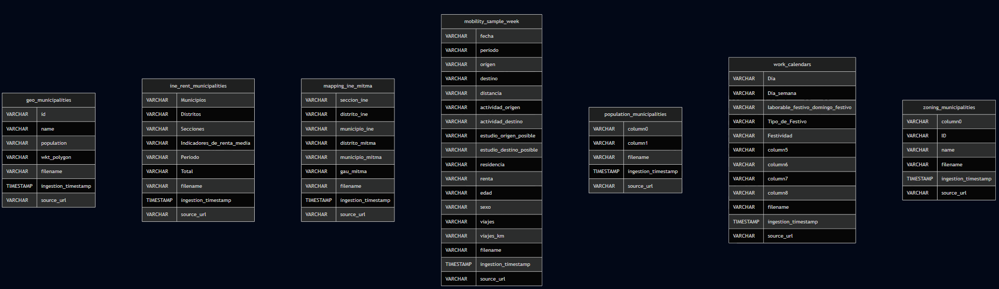
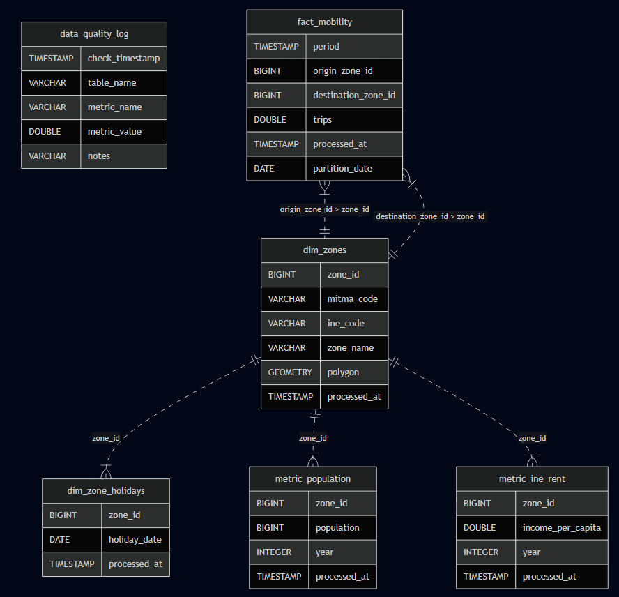
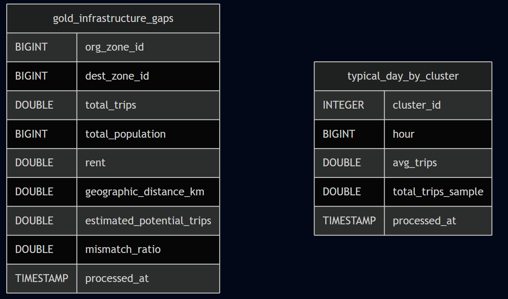

# Engineering Log: Sprint 3 - Schema reDesign and AirFlow

**Authors:**
- María López Hernández
- Fernando Blanco Membrives
- Joan Sánchez Verdú

**Date:** 04/12/2025

**Status:** In process

## 1. Sprint Overview & Objectives

**Key Goals for Sprint 3:**
1. ...

---

## 2. Data Sourcing & Exploration
Data acquisition strategies were updated to target Municipal-level datasets. We sourced data exclusively from public government repositories, ensuring open access compliance.
* **MITMA (Ministry of Transport)**:
    * Mobility Matrices: Daily O-D trips (switched to `Viajes_municipios` files).

    * Zoning: Municipal names and population registries.

    * Mapping: Cross-reference tables for MITMA-to-INE coding.

* **INE (National Statistics Institute)**:

    * Economics: Net income per person/household.

* **CNIG (National Center for Geographic Information)**:

    * Geography: Coordinates (centroids) for municipalities. !!!!!!!!!!!!!!!!!!!!!!!!!!!!!!!!!!!!!!!!!!!!!!!!!!!!!

* **Open Data**:

    * Calendars: National working/holiday calendars.
---

## 3. Proof of Concept Implementation

This section details the step-by-step implementation of the 3-tier lakehouse PoC.

### 3.1. Bronze Layer Ingestion `(In process)`

New file added `mitma/municipios_coord.geojson` with the `POLYGONS`and `MULTIPOLYGONS` for each municipality from MITMA.

**Schema:**
- 
---

### 3.2. Silver Layer Transformation `(In process)`

`fact_mobility`:
- `date` and `period` (hour) columns removed. Now there is one only `TIMESTAMP WITH ZONE` column (`period_time`). `partition_date` = `date` (only for the storage partition).

`dim_zones`:
- `polygon` column (Geometry) added to store the `POLYGONS`and `MULTIPOLYGONS` for each zone.

`data_quality_logs`: Table to store data quality checks
- `check_timestamp`: Time when the log was generated
- `table_name`: Name of the table of the metric
- `metric_name`: Name of the metric stored (i.e. avg_income_per_capita)
- `metric_vale`: Numeric value of the metric stored
- `notes`: Extra information needed for the metric

**Schema:**
- 

---

### 3.3. Gold Layer Analytics `(In process)`

`gold_infrastructure_gaps`
- Calculation of distance from `st_point(origin.longitude, origin.latitude)` to `ST_Centroid(geometry_column)`.

**Schema:**
- 

---

## Airflow
- Strategy
- Diagram